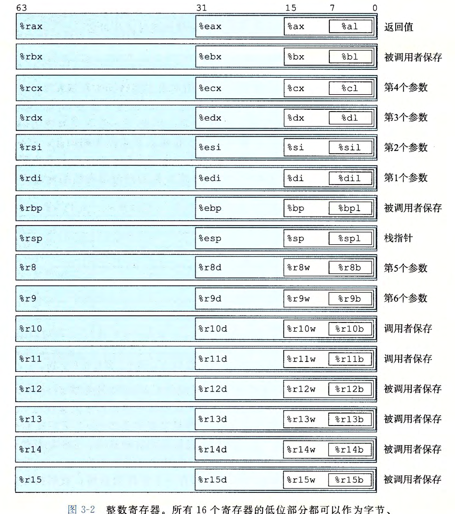

# csapp-lab
csapp lab

### datalab

[实验代码](http://csapp.cs.cmu.edu/3e/datalab-handout.tar)

使用64位环境编译32位程序很有可能出现如下错误提示：
```
/usr/bin/ld: 当搜索用于 /usr/lib/gcc/x86_64-redhat-linux/4.8.5/libgcc_s.so 时跳过不兼容的 -lgcc_s
```
以及
```
/usr/include/gnu/stubs.h:7:27: fatal error: gnu/stubs-32.h: No such file or directory
```

我们需要安装两个包：
```bash
$ sudo yum install -y glibc-devel.i686 libstdc++-devel.i686
```


### bomb lab

整数寄存器汇总


[gdb使用方法](http://csapp.cs.cmu.edu/3e/docs/gdbnotes-x86-64.pdf)

[实验代码](http://csapp.cs.cmu.edu/3e/bomb.tar)
在gdb调试过程中可能出现如下提示：
```
Missing separate debuginfos, use: debuginfo-install glibc-2.17-326.el7_9.x86_64
```
这里仅提供centos7的解决方法：
首先查看文件 `/etc/yum.repos.d/CentOS-Debuginfo.repo` 是否存在
- 存在，将enable更改为 **1**.`enable=1`
- 不存在，则需要手动创建该文件
```
[debug]
name=CentOS-7 - Debuginfo
baseurl=http://debuginfo.centos.org/7/$basearch/ 
gpgcheck=1
gpgkey=file:///etc/pki/rpm-gpg/RPM-GPG-KEY-CentOS-Debug-7 
enabled=1
```

修改完毕后执行以下命令：
```bash
$ sudo yum install glibc-debuginfo yum-utils
$ sudo debuginfo-install glibc-2.17-326.el7_9.x86_64
```

问题解决。

